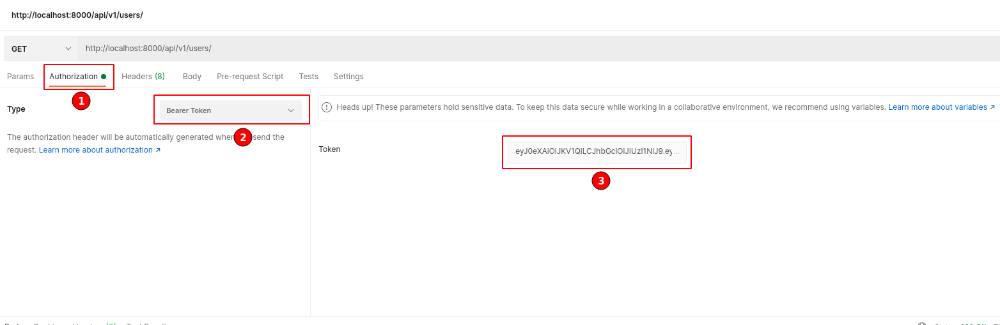

# Easynetwork, social network API

## How to run:  
1. Clone this repository:  
`git clone https://github.com/olksndrdevhub/starnavi_test_easynet_api.git`  

2. Activate your virtualvenv ("`conda activate <venv_name>`" or some other what you use)  

3. Navigate to project folder:  
`cd starnavi_test_easynet_api/`

4. Install requirements:  
`pip install -r requirements.txt`

5. Make migrate:  
`python manage.py migrate`  

6. Create superuser:  
`python manage.py createsuperuser`

7. Run server:  
`python manage.py runserver`

### For full testing this API you can user Postman(recommended) or httpie. Browsable API got some restrict couse some endpoints need JWT Authentication, so it is not recommended to test with a browser.

## Authentication:  

For Authentication you need to get JWT Access/Refresh Tokens. Of course you need to have previosly registered account ([go to 'creating account' endpoint](#creating_account)). You need send POST request to `http://localhost:8000/api/v1/token/` endpoint with your username and password in request body:  
<pre>
{
    "username":"your_username",
    "password":"Your_password"
}
</pre>  
This will return for you Access Token(AT) and Refresh Token(RT). AT will live 20 minutes. If your AT dead - send POST request to `http://localhost:8000/api/v1/token/refresh/` with your RT in request body:  
<pre>
{
    "refresh":"your_refresh_token"
}
</pre>  
After that you receive new AC. Your RT will live only 1 day, if RT is dead - you need to get JWT Access/Refresh Tokens again (see above).

<b>If you need to authentication in Postman go to Authorization tab(1), select Type as Bearer Token(2) and paste your AT in field(3).</b>  

## Endpoints:  

`http://localhost:8000/` - Index view of project. Return link to Index API view. Only GET method allowed.  

`http://localhost:8000/api/v1/` - Index endpoint of API. Return links to Users view and Posts view. Only GET method allowed.  

`http://localhost:8000/api/v1/users/` - Users endpoint.  Return list of users in GET request (only for user with superuser status(!)) or create new user in POST request. Require Authentication(!) for GET request. To create new user send POST request with `username`, `email`, and `password` in request body:
<pre>
{
    "username":"your_username",
    "email": "your_email",
    "password":"Your_password"
}
</pre>

`http://localhost:8000/api/v1/posts/` - Posts endpoint. Allow to get list of posts (GET method, require authentication) or create new post (POST method, require authentication).  
To create new Post just send POST request to this endpoint with `title`, `body`, and `likes`* (can be empty) in request body:
<pre>
{
    "title":"post_title",
    "body":"post_bosy",
    "likes":[]
}
</pre>
or
<pre>
{
    "title":"post_title",
    "body":"post_body",
    "likes":[1,2,5]
}
</pre>
*`likes` - it\`s id`s of users who likes this post

`http://localhost:8000/api/v1/posts/<id>/` - Endpoint for post with `id=post id`. Here you can get, update, delete post. Require authentication.  
Return selected post.

`http://localhost:8000/api/v1/posts/<id>/like/` - Endpoint for like or unlike post with `id=post id`. Only GET request with required authentication. First request add current user ID to `post.likes` list, next one request remove current user from this list - it`s like/unlike mechanism.  
Return selected post.

`localhost:8000/api/v1/analitics/likes/` - Analitics endpoint for likes. Can be accessible by anyone. Return total count of likes and list of likes per post in format:  
<`date of post created`> <`post title>`: <`post likes count`>.
<pre>
{
    "Total likes": 3,
    "Likes per post": [
        {
            "2021-03-14 testpostuser1": 1
        },
        {
            "2021-03-14 posttitle2": 2
        }
    ]
}
</pre>

Also can accept query_params `from_date=` and `to_date=` to get posts and likes in some date range. Endpoint for this request must look like:  
`localhost:8000/api/v1/analitics/likes/?from_date=yyyy-mm-dd&to_date=yyyy-mm-dd`  

`localhost:8000/api/v1/analitics/users/` - Analitics endpoint for users. Can be accessible by anyone. Return list of users with `last_login`, `last_request`, `date_joined` params per user. 
<pre>
[
    {
        "username_first": {
            "Last Login": null,
            "Last Request Time": "",
            "Date Joined": "2021-03-14T10:45:01.358031Z"
        }
    },
    {
        "username_second": {
            "Last Login": null,
            "Last Request Time": "2021-03-14 12:45:26.821098+00:00",
            "Date Joined": "2021-03-14T11:12:17.509658Z"
        }
    }
]
</pre>
